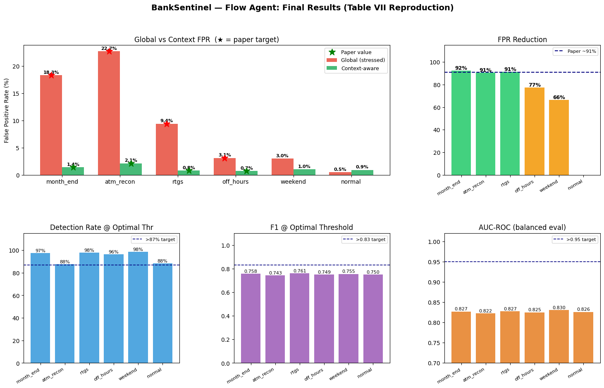
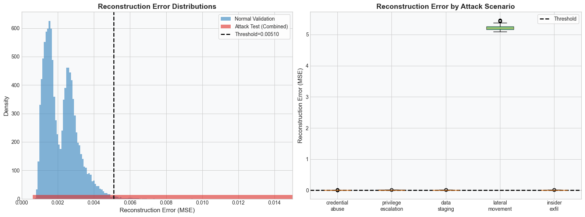

# BankSentinel AI 

BankSentinel is a **Five-Agent AI Intrusion Detection System (IDS)** explicitly engineered for real-time threat correlation in high-security Financial and Banking Networks (with specific tuning for Nepal Rastra Bank regulations).

Traditional IDS platforms generate massive amounts of "alert fatigue" by treating every anomaly as a separate event. BankSentinel solves this by deploying a team of independent AI agents that evaluate raw network traffic, and a master Correlation Agent that fuses their findings into a single Composite Risk Score (CRS), automatically suppressing noise and isolating true threats.

---

##  The Multi-Agent Architecture

The system operates using 5 independent, specialized AI Agents:

1. **Packet Agent**: Analyzes encrypted TLS 1.3 traffic (JA3/JA3S fingerprints) and beacon timings to detect Command & Control (C2) communication without breaking encryption.
2. **Flow Agent**: Analyzes bulk network flow metadata (bytes, duration, ports) using Isolation Forests to catch lateral movement and ransomware spray.
3. **Behavior Agent**: Context-aware BiLSTM model that understands operational hours (e.g., Nepal banking hours) to catch insider threats and unauthorized access.
4. **Correlation Agent**: The "brain" of the system. It fuses the outputs of the other agents into a Composite Risk Score (CRS), handles deduplication, groups related events into Campaign Tickets, and filters out false positives.
5. **Response Agent**: Triggers automated, millisecond-speed containment actions (like IP blocks and host quarantines) when the CRS crosses the Critical threshold.

---

##  Threat Scenarios Addressed

BankSentinel natively detects and mitigates the most dangerous vectors targeting the financial sector:

*   **SWIFT / RTGS Gateway Compromise**: Detects APT lateral movement, C2 beaconing, and unauthorized core banking database queries (e.g., Lazarus Group tactics).
*   **ATM Switch & PIN Harvesting**: Detects Man-in-the-Middle (MitM) attacks and data exfiltration from ATM switches that deviate from standard ISO 8583 payment messaging.
*   **Insider Zero-Day Exfiltration**: Catches rogue employees accessing sensitive databases at unusual hours and exfiltrating bulk data.
*   **Ransomware Propagation**: Detects massive RDP/SMB lateral movement spray (WannaCry/LockBit profiles) and instantly suppresses the redundant alerts to prevent alert fatigue.

---

##  Features

*   **Multi-Agent AI Pipeline**:
    *   **Encrypted Traffic Analysis**: Inspects JA3/JA3S TLS fingerprints to identify malicious C2 channels without breaking encryption.
    *   **Behavioral Context Gating**: Uses a BiLSTM model to evaluate if an action is malicious based on the time of day, employee role, and typical banking hours.
    *   **Bayesian Alert Fusion**: Merges outputs from all sub-agents into a single Composite Risk Score (CRS), preventing alert floods.
*   **SOC Analyst Dashboard**:
    *   **Live Alert Stream**: Real-time websocket-powered feed of all network anomalies, prioritized by severity.
    *   **Agent Health Telemetry**: Live statistics on processing time, suppression rates, and individual agent confidence scores.
    *   **Network Topology Graph**: Dynamic attack graph visualization that highlights compromised nodes and active C2 channels as they occur.
*   **Red Team Simulator**: A built-in adversary simulation engine that fires complex attack chains at the pipeline to demonstrate the system's alert suppression capabilities (e.g. squashing hundreds of duplicate ransomware propagation alerts down to a single incident).
*   **Automated Containment & Cryptographic Ledger**: Bypasses human reaction times by autonomously blocking IPs the millisecond a Critical alert is fused. All automated actions are logged using a SHA-256 cryptographic hash chain to guarantee tamper-proof records for auditors.
*   **NRB Compliance Reporting**: One-click generation of PDF incident reports mapped directly to the Nepal Rastra Bank (NRB) Cyber Security Framework.

---

##  Technology Stack

*   **Backend**: Python, FastAPI, WebSockets, Pandas, Scikit-Learn.
*   **Frontend**: React, TypeScript, Vite, Tailwind CSS, Framer Motion.
*   **Database**: In-memory agent state (Simulator) with persistent cryptographic ledgers.

---

##  How to Run Locally

### 1. Start the Backend API
The backend is built with FastAPI and requires Python 3.10+.
```bash
cd api
pip install -r requirements.txt
uvicorn main:app --reload --host 0.0.0.0 --port 8000
```
*Note: The backend includes a background simulator that automatically injects background noise and simulated attacks.*

### 2. Start the Frontend Dashboard
The frontend is a modern React application built with Vite.
```bash
cd frontend
npm install
npm run dev
```
Navigate to `http://localhost:5173` to access the SOC Dashboard.

---

##  Demo

Here is a view of the finished BankSentinel product in action:

### SOC Dashboard Overview

*Real-time alert stream and multi-agent pipeline monitoring dashboard, showing active threat telemetry and Composite Risk Score (CRS).*

### Threat Analysis & Audit

*Detailed threat analysis, alert fusion demonstration, and cryptographic audit visibility across the dashboard experience.*

---

##  Repository Notes

Please note that the following directories are intentionally excluded from version control to keep the repository lightweight:
- **`data/`**: Raw packet captures and large datasets (CICIDS-2018, CTU-13) used for model training.
- **`models/`**: Compiled machine learning artifacts (`.pkl`, `.pt`). 

To run the system in full production inference mode, train the models via Google Colab and place the generated artifacts into the `models/` directory. By default, the system will run using the embedded rule-based/statistical fallback simulator for demonstration purposes.
