# BankSentinel AI — Complete Pipeline Architecture

## System Pipeline Diagram

---

## Detailed Mermaid Flowchart

```mermaid
flowchart TD
    %% ── STYLE DEFINITIONS ─────────────────────────────────────────────
    classDef input      fill:#1e3a5f,stroke:#4a9eff,color:#e0f0ff,stroke-width:2px
    classDef ingest     fill:#0d3d3d,stroke:#00e5cc,color:#ccfffa,stroke-width:2px
    classDef packet     fill:#0a1f4d,stroke:#3b8aff,color:#cce0ff,stroke-width:2px
    classDef flow       fill:#0a3d1a,stroke:#2ecc71,color:#ccffdd,stroke-width:2px
    classDef behavior   fill:#2a0d4d,stroke:#9b59b6,color:#eeddff,stroke-width:2px
    classDef corr       fill:#4d2a00,stroke:#f39c12,color:#fff3cc,stroke-width:2px
    classDef response   fill:#4d0a0a,stroke:#e74c3c,color:#ffd6d6,stroke-width:2px
    classDef output     fill:#3d3000,stroke:#f1c40f,color:#fff8cc,stroke-width:2px
    classDef challenge  fill:#111,stroke:#555,color:#aaa,stroke-width:1px,stroke-dasharray:5 5

    %% ── LAYER 0: DATA INPUTS ─────────────────────────────────────────
    subgraph INPUTS["  📡  DATA INPUTS  "]
        direction LR
        I1["📡 Raw Network Traffic\nPCAP / Kafka Stream"]:::input
        I2["🔐 TLS 1.3 Metadata\nJA3 / JA3S Fields"]:::input
        I3["📋 Windows Event Logs\nWinlogbeat / SIEM"]:::input
    end

    %% ── LAYER 1: INGESTION PIPELINE ──────────────────────────────────
    subgraph INGEST["  ⚙️  INGESTION PIPELINE  "]
        direction TB
        IG1["FlowRecord Construction\n— Shared Message Bus for all Agents"]:::ingest
        IG2["Nepal Regime Labelling\n— UTC+5:45 Context Assignment"]:::ingest
        IG3["Feature Extraction\n— 15 CICIDS-2018 Network Flow Features"]:::ingest
        IG1 --> IG2 --> IG3
    end

    %% ── LAYER 2: THREE ANALYTICAL AGENTS ─────────────────────────────
    subgraph PA["  🔵  PACKET AGENT  (Challenge C4)  "]
        direction TB
        P1["Layer 1 — JA3 Hash Lookup\nabuse.ch SSLBL Feed\nWeight: 0.55 | C2 IP: 0.32 | Tor: 0.13"]:::packet
        P2["Layer 2 — JA3S Cross-Signal\nServer-side TLS Fingerprint\nConf: 0.65 when client clean"]:::packet
        P3["Layer 3 — CTU-13 RF Classifier\nBeacon IAT / Flow Entropy\nThreshold: 0.50"]:::packet
        P4["📦 PacketAlert\n{confidence, is_threat,\nactive_layers, mitre_technique}"]:::packet
        P1 --> P2 --> P3 --> P4
    end

    subgraph FA["  🟢  FLOW AGENT  (Challenge C2)  "]
        direction TB
        F1["6 Context-Aware Isolation Forests\n——————————————\n🕛 month_end  ψ=8×10⁻⁴\n🌙 atm_recon  ψ=6×10⁻⁴\n💳 rtgs       ψ=5×10⁻⁴\n🌃 off_hours  ψ=4×10⁻⁴\n📅 weekend    ψ=3×10⁻⁴\n☀️ normal     ψ=5×10⁻⁴"]:::flow
        F2["Regime Router\nNepal UTC+5:45 Time Mapping"]:::flow
        F3["📦 FlowAlert\n{anomaly_score, regime,\nconfidence, mitre_technique}"]:::flow
        F2 --> F1 --> F3
    end

    subgraph BA["  🟣  BEHAVIOR AGENT  (Challenge C1)  "]
        direction TB
        B1["BiLSTM Autoencoder\nInput: 8 dims × seq_len=20\nhidden=128, layers=2, bidirectional"]:::behavior
        B2["Trained on NORMAL only\n95th percentile MSE threshold\nZero-Day: no attack signature needed"]:::behavior
        B3["5 Scenarios Detected\ncredential_abuse | priv_escalation\ndata_staging | lateral_movement\ninsider_exfil"]:::behavior
        B4["📦 BehaviorAlert\n{recon_error, is_anomaly,\nscenario_hint, mitre_technique}"]:::behavior
        B1 --> B2 --> B3 --> B4
    end

    %% ── LAYER 3: CORRELATION AGENT ────────────────────────────────────
    subgraph CA["  🟠  CORRELATION AGENT  —  Central Intelligence Brain  (Challenge C3)  "]
        direction TB
        C1["Bayesian Belief Network\nP(ThreatCampaign=1) prior = 3.2×10⁻⁴\nCPD: Packet(TPR=0.85) Flow(TPR=0.78) Behavior(TPR=0.72)\nVariable Elimination — pgmpy"]:::corr
        C2["CRS = 0.28×S_pkt + 0.24×S_flow + 0.26×S_beh + 0.22×BBN_posterior"]:::corr
        C3["4-Layer Suppression Engine\n① Deduplication — 5-min sliding window\n② Causal Chaining — 10-min campaign grouping\n③ Confidence Gating — CRS < 0.40 → suppress\n④ Context Filtering — operational calendar noise"]:::corr
        C4["Priority Classification\nINFO•LOW•MEDIUM•HIGH•CRITICAL≥0.85\n87% Alert Volume Reduction"]:::corr
        C5["📦 CorrelationResult\n{CRS, bbn_posterior, priority,\ncampaign_ticket_id, agents_fired}"]:::corr
        C1 --> C2 --> C3 --> C4 --> C5
    end

    %% ── LAYER 4: RESPONSE AGENT ───────────────────────────────────────
    subgraph RA["  🔴  RESPONSE AGENT  —  Automated Containment  "]
        direction LR
        R1["① Host Quarantine\nNAC/EDR < 500ms"]:::response
        R2["② Firewall Block\nEdge IP Block"]:::response
        R3["③ STIX 2.1 Export\nMachine-readable\nThreat Indicators"]:::response
        R4["④ NRB PDF Report\nNRB Sec 4.5\nPCI-DSS 10.3\nSWIFT CSP"]:::response
        R5["⑤ SHA-256\nHash Chain\nAudit Log\nHₙ=SHA256(Hₙ₋₁‖action‖ts)"]:::response
    end

    %% ── LAYER 5: OUTPUTS ──────────────────────────────────────────────
    subgraph OUTPUTS["  📤  FINAL OUTPUTS  "]
        direction LR
        O1["📊 SOC Dashboard\nReact + WebSocket\nLive Alert Stream\nNetwork Topology Graph"]:::output
        O2["📄 Compliance Reports\nNRB / PCI-DSS\nSTIX 2.1 Bundles\nForensic Audit Trail"]:::output
        O3["🤖 AI SOC Assistant\nGemini LLM Chatbot\nMITRE ATT&CK Mapping\nAlert Explanation"]:::output
    end

    %% ── CHALLENGE LABELS ──────────────────────────────────────────────
    C4_LBL["🔐 C4\nEncrypted\nTLS"]:::challenge
    C2_LBL["⚡ C2\nFalse\nPositives"]:::challenge
    C1_LBL["🎯 C1\nZero-Day\nAttacks"]:::challenge
    C3_LBL["🔇 C3\nAlert\nFatigue"]:::challenge

    %% ── CONNECTIONS ───────────────────────────────────────────────────
    I1 & I2 --> INGEST
    I3 --> INGEST

    INGEST --> PA
    INGEST --> FA
    INGEST --> BA

    C4_LBL -.-> PA
    C2_LBL -.-> FA
    C1_LBL -.-> BA
    C3_LBL -.-> CA

    P4 --> CA
    F3 --> CA
    B4 --> CA

    CA --> RA

    R1 & R2 & R3 & R4 & R5 --> OUTPUTS

    CA --> O1

    %% ── LINK STYLES ───────────────────────────────────────────────────
    linkStyle default stroke:#555,stroke-width:1.5px
```

---

## Layer-by-Layer Summary

| Layer | Component | Challenge | Key Technology |
|-------|-----------|-----------|---------------|
| **0** | Data Inputs | — | PCAP, Kafka, Winlogbeat |
| **1** | Ingestion Pipeline | C2, C4 | `FlowRecord`, Nepal UTC+5:45 regime labelling |
| **2a** | Packet Agent | **C4** | JA3/JA3S fingerprinting + CTU-13 Random Forest |
| **2b** | Flow Agent | **C2** | 6× Context-Aware Isolation Forest |
| **2c** | Behavior Agent | **C1** | BiLSTM Autoencoder (trained on normal only) |
| **3** | Correlation Agent | **C3** | Bayesian Belief Network + 4-layer suppression |
| **4** | Response Agent | C3, Compliance | Hash chain, STIX 2.1, NRB PDF |
| **5** | Outputs | — | SOC Dashboard, Reports, LLM Assistant |
